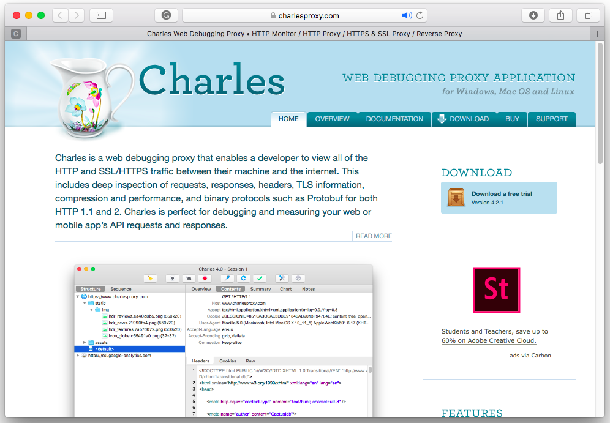
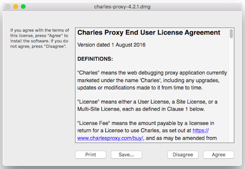
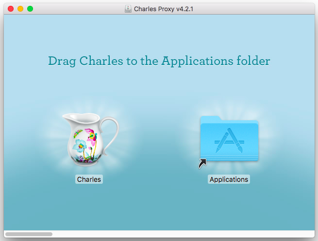
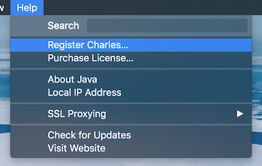
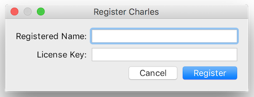

# How-to-use-charles-proxy
How to use charles proxy

Nếu bạn là một mobile developer, mình khá chắc là bạn đã từng gặp qua tình huống éo le vỡ UI ít nhất một lần trong đời. Vỡ UI thường được bắt gặp khi mà bạn có một cái text, nội dung của cái text này được lấy bằng cách truy xuất database, hoặc từ kết quả mà API trả về. Cơ mà bạn lại quên mất việc kiểm tra UI khi nội dung cái text này dài ra trên các màn hình khác nhau, dẫn tới hậu quả UI của bạn banh chè.

Mục đích của bài viết này giúp các bạn làm quen với một tool rất chy là bá đạo, cân từ debugging đến testing.

Ví dụ nhé, nó giúp bạn có thể test các hiển thị lên UI của nhiều data set khác nhau như thế nào, ngay cả khi bạn chưa implement API. Trong một diễn biến khác, nó có thể giúp bạn debugging cách bạn call API đã đúng chưa: kiểm tra bạn đang gọi GET/POST/..., header ra sao, parameter như nào,... Ngoài ra nó còn cho phép bạn test những trường hợp download mạng chậm nữa.

Và cái tool thần thánh được nhắc đến trong bài viết này chính là Charles - Web Debugging Proxy Application.

## Mục lục
- [Download Charles](#install-charles)
- [Install Charles](#install-charles)
- [Configure Charles và môi trường](#configure-charles-và-môi-trường)
	- [Config Proxy](#config-proxy)
 		- [Enable macOS Proxy for Charles](#enable-macos-proxy-for-charles)
 		- [Config proxy cho iOS Device](#config-proxy-cho-ios-device)
 		- [Config proxy cho iOS Simulator](#config-proxy-cho-ios-simulator)
	- [Configuring SSL Proxying Certificates](#configuring-ssl-proxying-certificates)
		- [Add Charles CA Certificate](#add-charles-ca-certificate)
		- [Enable SSL Proxying Setting](#enable-ssl-proxying-setting)
		- [Trusting Charles's SSL Certificates](#trusting-charles-s-ssl-certificates)

## Download Charles
<a href="https://www.linkedin.com/in/hi%E1%BB%83n-mai-v%C3%B5-ng%E1%BB%8Dc-b59674216/" target="blank"> Link here </a> 

## Install Charles

Để cài đặt Charles cần:

	

- Khởi động installer đã down về, hoàn thành theo chỉ dẫn:

	
	

- Khởi động Charles:

	

- Gói Charles free cho 30 ngày, vào đây để mua license nhé. Sau đó thì đi tới __Help > Register Charles... > Điền Register Name và License Key__ để đăng ký rồi restart lại Charles.

	
	 
	
	

